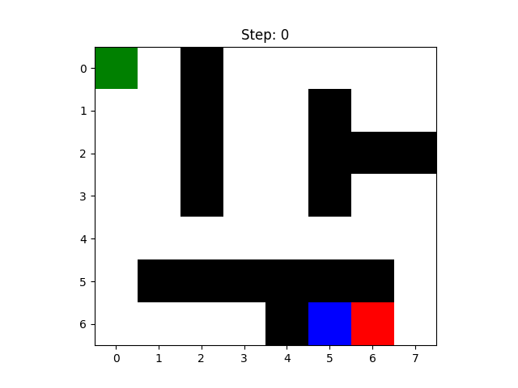
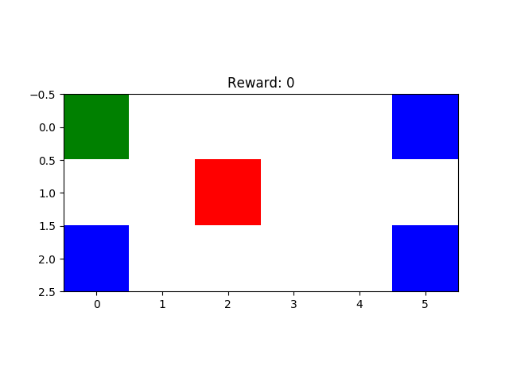
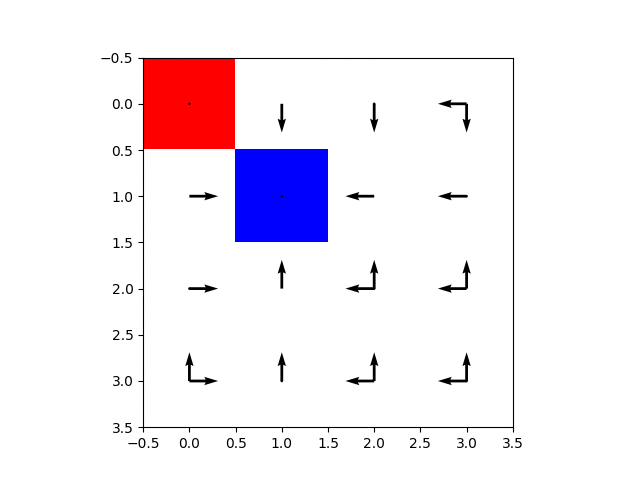
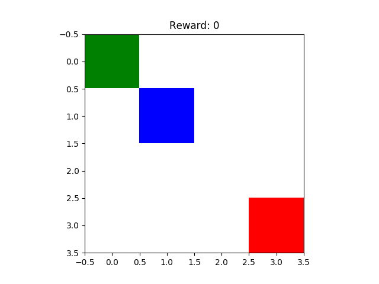

# Reinforcement Learning Algorithms Implementations

KTH Reinforcement Learning (EL2805) 2019 coding assignments. As all my other repos, this is more an exercise for me to understand the algorithms rather than useful code. Hope it also helps you!

## LAB 1

### Dynamic Programming in finite fully-observable stochastic MDP
Agent (green) escaping (blue) a maze with walls (black) with a monster (red) following a uniform random walk capable of crossing walls: [code](lab_1/p1/b.py)

### Value Iteration in infinite fully-observable stochastic MDP
Agent (green) robbing banks (blue) while escaping a police (red) which follows a random walk, never going away from him: [code](lab_1/p2/) 

### SARSA (following epsilon-greedy policy) in infinite non-observable stochastic MDP
Policy learned by the agent for every Police (red) position: [code](lab_1/p3/)

### Q-Learning (from uniform policy) in infinite non-observable stochastic MDP
Agent (green) robbing again banks (blue) while escaping a police (red) who follows a random walk: [code](lab_1/p3/)

